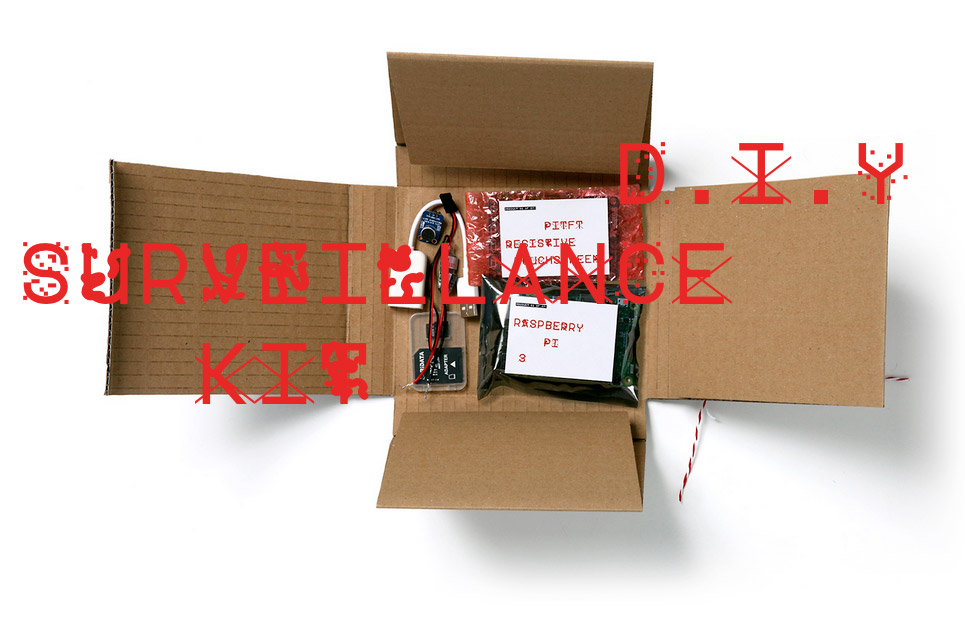

# The IseeU DIY spy kit



# The project


<b>Everyone is listening.</b>

Governments and corporations are already listening, so why shouldn’t we? This new DIY Surveillance Kit enables everyone to spy on everyone. But unlike conventional eavesdroppers, we’ll listen to conversations and turn them into fun. Once assembled, simply point the parabolic microphone in the direction of the people you want to spy on, and watch as private conversations transform into real-time gifs on the device itself.

In the wild and wonderful world of memes, gifs, cats, snaps, lazers and emojis, it’s easy to forget that what we do and share is being collected and distributed.


<b>The art of spying.</b>

The DIY surveillance kit is an art project designed to raise awareness of data collection, privacy and transparency. Issues that will become even more important in the next 5-10 years as we continue to digitize every aspect of our lives.


# Table of contents


* [Electronics - Bill of Materials](#electronics)

* [Power supply wiring](#wiring)

* [Installation](#installation)

* [Easy setup](#easy)

* [Advanced setup](#advanced)

  * [Flash the SD card](#flashcard)

  * [Connect to the Pi with SSH](#ssh)

  * [Disable Wifi Power Management](#wifipm)

  * [Install Matchbox Virtual keyboard](#virtualkeyboard)

  * [Change desktop background (optional)](#background)

  * [Remove the enormous wastebasket icon (optional)](#wastebasket)

  * [Install Chromium & Apache Server](#chromium)

  * [Install Apache server](#apache)

  * [Setup the piTFT buttons](#pibuttons)

  * [Configure autostart file](#autostart)

  * [Configure audio](#audio)

  * [Laser cutting](#lasercut)

  * [Laser cut parts assembly](#buildingmanual)

  * [Usage](#usage)

<a name="electronics"/>
# Electronics - Bill of Materials
</a>
* 1 Raspberry Pi 3 Model B 1Gb RAM ([http://www.adafruit.com/products/3055](http://www.adafruit.com/products/3055))  
* 1 Micro SD card 8Gb or 16Gb ([http://dk.farnell.com/transcend/tsraspi10-16g/16gb-microsd-card-preloaded-with/dp/2521753](http://dk.farnell.com/transcend/tsraspi10-16g/16gb-microsd-card-preloaded-with/dp/2521753))  
* 1 Adafruit PiTFT Plus Assembled 320x240 2.8" TFT + Resistive Touchscreen ([http://www.adafruit.com/products/2298](http://www.adafruit.com/products/2298))  
* 1 USB Audio Adapter ([http://www.adafruit.com/product/1475](http://www.adafruit.com/product/1475))  
* 1 UBEC DC/DC Step-Down Converter - 5V, 3A output ([http://www.adafruit.com/product/1385](http://www.adafruit.com/product/1385))  
* 1 8xAA battery holder ([http://www.adafruit.com/products/449](http://www.adafruit.com/products/449))  
* 1 toggle switch SPDT ON - ON or SPST, I found those ones in Denmark   [http://www.elextra.dk/main.aspx?page=article&artno=H12576](http://www.elextra.dk/main.aspx?page=article&artno=H12576),  beware if (ON) is in between parentheses it won’t hold the position (momentary position)
* 1 common screw connector for 2,5 mm2 wire [http://www.elextra.dk/main.aspx?page=article&artno=H24146](http://www.elextra.dk/main.aspx?page=article&artno=H24146)

<a name="power"/>
# Power supply wiring
</a>
Before installing anything, we are gonna power up the Raspberry Pi through the GPIO pins.
**Do not put the batteries in the battery holder yet, or you risk to fry the Raspberry Pi!**  
  
Shorten the 3 pin connector with a Dremel or a cutter knife of the UBEC voltage converter to fit the PiTFT when it\s on top of the Raspberry Pi.
Solder 2 cables on the toggle switch.
Take the screw connector 3x2 pins, and connect the 2 wires from the toggle switch to it as described in the illustration above.  
Then connect the UBEC converter to it, and connect the other side to the PiTFT between the Pins 2 and 6 black wire facing downwards.
<b>Beware Pins 2 and 4 are +5V (red wire on pin 4), pin 6 is Ground (GND).</b>  
Then connect the 8xAA battery holder to the screw connector.  
Verify the toggle switch is in off position as on the picture below:  

Once switch is off, put the AA batteries into the battery holder.

You can now put the PiTFT on top of the Raspberry Pi, but don’t switch on the power yet, since we need to install the software.

<a name="installation"/>
# Installation
</a>
Raspberry Pi 3 is a business card size computer that works on Linux, Windows 10, or Chromium OS.
Linux comes in lots of distributions, the one we use here is a customised version of Raspbian Jessie by Adafruit, to be able to use the PiTFT.
<a name="easy"/>
# Easy setup
</a>
Download the image zip from http://bit.ly/2dp3b0V.

Insert a blank the mini SD card with an adapter into a computer.
Burn the image on a 16Gb SD card but a 8Gb would do as well.

## on Mac OSX

To do so, I used ApplePi-Baker ([http://www.tweaking4all.com/software/macosx-software/macosx-apple-pi-baker/](http://www.tweaking4all.com/software/macosx-software/macosx-apple-pi-baker/)) on Mac OS X to burn the image.


You will be ask to enter your computer admin password since root privileges are required to access the disk and burn the image.


Your SD card should appear on the left side,
select it.

Then browse to the image file and click on the Restore Backup button.

It should take about 25 minutes to burn the image.


Once the image is burned, you can insert it in the mini SD card slot underneath the Raspberry Pi.

## on Windows & Linux

The process is similar.
Follow the instructions from this page: http://elinux.org/RPi_Easy_SD_Card_Setup

<a name="advanced"/>
# Advanced setup
</a>
<a name="flashingcard"/>
## Flash the SD card
</a>
Install The Jessie-based image from Adafruit PiTFT setup tutorial named
Jessie-based PiTFT 2.4" and 2.8" Resistive Image for Pi 1, Pi 2 and Pi 3 (March 25, 2015), available here:
https://learn.adafruit.com/adafruit-pitft-28-inch-resistive-touchscreen-display-raspberry-pi/easy-install

Burn the image on a 8Gb or more SD card using ApplePi-Baker on Mac OS X or Win32DiskImager on Windows using the same process as for the easy install.

Add the PiTFT Touchscreen on top of the Raspberry Pi
Insert the SD card in the Raspberry pi slot.

Boot up the Raspberry Pi
<a name="ssh"/>
## Connect to the Pi with SSH
</a>
Connecting to the Pi with SSH makes it much easier to install the libraries needed to make our spy kit.

For the first wifi setup, you will either need a usb keyboard, or

### without a USB keyboard

I recommend this tutorial you can follow from step number 3 http://blog.self.li/post/63281257339/raspberry-pi-part-1-basic-setup-without-cables

### with a USB keyboard

Plug a USB keyboard to the Pi.

Click on the terminal icon on the top menu select your wifi network and fill in your password.
Once connected mouseover the wifi network icon, you will see the ip address of the pi.
Write down this ip address.

You can then access your pi via ssh with your mac.
It works best if your mac and the Pi are on the same Wifi network.

Open a terminal window on your mac.
The Terminal app is located in Applications/Utilities/Terminal

Open a ssh connection by typing
```
ssh pi@xxx.xxx.xxx.xxx
```
with xxx.xxx.xxx.xxx being the ip address you found earlier

You will be prompt to enter a password. By default the pi password is “raspberry”.
If you used the easy setup the pi password is “iseeu2016”.

If everything goes well, you will see appearing:

```
pi@raspberrypi:~ $
```

if not, follow the steps described here:
https://www.raspberrypi.org/documentation/remote-access/ssh/
<a name="wifipm"/>
## Disable Wifi Power Management
</a>
I was experiencing drop outs on the wifi internet connection, it appeared that the internet chip was  turning itself off after an idle period.
To maintain the wifi connection, we need to disable the wifi power management.

To do that I followed the article (http://www.modmypi.com/blog/disable-wifi-power-management)
I made a backup of the network interfaces file

```
sudo cp /etc/network/interfaces /etc/network/interfaces.backup
```
and edited the original interfaces file:
```
sudo nano /etc/network/interfaces
```
Then unless you already changed something you can delete  all the content of the file and copy/ paste the following to it:
```
auto lo

iface lo inet loopback
iface eth0 inet dhcp

auto wlan0
allow-hotplug wlan0
iface wlan0 inet dhcp
wpa-conf /etc/wpa_supplicant/wpa_supplicant.conf
wireless-power off
iface default inet dhcp
```
Now exit the nano editor and save your changes:

Ctrl+x
Y
Enter

And reboot your raspberry pi:
```
sudo reboot
```
Once the raspberry pi has rebooted, check if the wifi power management has been disabled
```
iwconfig
```
And check for the line:
```
Power Management:off
```

<a name="virtualkeyboard"/>
## Install Matchbox Virtual keyboard
</a>
Matchbox virtual keyboard allows writing directly on the touchscreen without the need of an external usb keyboard.
With a instructions from the ozzmaker website (http://ozzmaker.com/virtual-keyboard-for-the-raspberry-pi/)
I installed matchbox virtual keyboard
```
sudo apt-get install libfakekey-dev libpng-dev libxft-dev autoconf libtool -y
git clone https://github.com/mwilliams03/matchbox-keyboard.git
cd matchbox-keyboard
./autogen.sh
make
sudo make install
sudo apt-get install libmatchbox1 -y
```

Then we create a toggle script to start and stop matchbox keyboard
```
sudo nano /usr/bin/toggle-matchbox-keyboard.sh
```
copy paste the code below
```
#!/bin/bash
#This script toggle the virtual keyboard

PID=`pidof matchbox-keyboard`
if [ ! -e $PID ]; then
  killall matchbox-keyboard
else
 matchbox-keyboard -s 100 extended&
fi
```
And exit nano

Ctrl+x
Y
Enter

We then make it executable
```
sudo chmod +x /usr/bin/toggle-matchbox-keyboard.sh
```
And create the menu item script
```
sudo nano /usr/share/applications/toggle-matchbox-keyboard.desktop
```
then copy and paste the text:
```
[Desktop Entry]
Name=Toggle Matchbox Keyboard
Comment=Toggle Matchbox Keyboard
Exec=toggle-matchbox-keyboard.sh
Type=Application
Icon=matchbox-keyboard.png
Categories=Panel;Utility;MB
X-MB-INPUT-MECHANSIM=True
```
And finally create the top menu icon.
```
nano ~/.config/lxpanel/LXDE-pi/panels/panel
```
Find this section of config:
```
Plugin {
  type=launchbar
  Config {
   Button {
     id=/usr/share/raspi-ui-overrides/applications/epiphany-browser.desktop
   }
   Button {
     id=/usr/share/raspi-ui-overrides/applications/pcmanfm.desktop
   }
```
And change it to:

```
Plugin {
  type=launchbar
  Config {
   Button {
     id=/usr/share/raspi-ui-overrides/applications/epiphany-browser.desktop
   }
   Button {
     id=/usr/share/raspi-ui-overrides/applications/pcmanfm.desktop
   }
   Button {
     id=/usr/share/applications/toggle-matchbox-keyboard.desktop
   }
```

Since the PiTFT desktop is small, I got rid of some of the icons by commenting them, here is my config of the launchbar section:

```
Plugin {
  type=launchbar
  Config {
#    Button {
#      id=/usr/share/raspi-ui-overrides/applications/epiphany-browser.desktop
#    }
    Button {
      id=/usr/share/raspi-ui-overrides/applications/pcmanfm.desktop
    }
     Button {
       id=/usr/share/applications/toggle-matchbox-keyboard.desktop
     }
#     Button {
#      id=/usr/share/raspi-ui-overrides/applications/lxterminal.desktop
#     }
#    Button {
#      id=/usr/share/raspi-ui-overrides/applications/wolfram-mathematica.desktop
#    }
#    Button {
#      id=/usr/share/raspi-ui-overrides/applications/wolfram-language.desktop
#    }
  }
}
```
<a name="background"/>
## Change desktop background (optional)
</a>
You can as well change the Desktop background in this file.
Copy a desktop image to documents.
You can do it from command line (CLI) with scp command, or by FTP using the ipaddress of the pi and the logins (pi/raspberry)

Look for backgroundfile:
```
Global {
  edge=top
  allign=left
  margin=0
  widthtype=percent
  width=100
  height=36
  transparent=0
  tintcolor=#000000
  alpha=0
  autohide=0
  heightwhenhidden=2
  setdocktype=1
  setpartialstrut=1
  usefontcolor=0
  fontsize=12
  fontcolor=#ffffff
  usefontsize=0
  background=0
#  backgroundfile=/usr/share/lxpanel/images/background.png
  backgroundfile=/Documents/desktop.png
  iconsize=36
}
```
Then save and close (Ctrl+x Y Enter)
<a name="wastebasket"/>
## Remove the enormous wastebasket icon (optional)
</a>
Edit the desktop items file
```
nano .config/pcmanfm/LXDE-pi/desktop-items-0.conf
```
And change
```
show_trash=1
```
to
```
show_trash=0
```

<a name="chromium"/>
## Install Chromium & Apache Server
</a>
The IseeU application uses HTML5 Webkit Speech Recognition in Chromium, which acts the same as when you click on the microphone in google search input field.
Since we don’t want to be prompt for microphone access, one way is to install a server and launch the app with localhost address.

A nodejs web server would do as well, but I choose to go for an Apache server.

Chromium browser is an open source project based on Chrome that integrates speech recognition as well.
To know more about chromium browser [look here](https://www.chromium.org/Home)

Chromium needs Google speech API keys you can follow the instructions here to get them:
[https://www.chromium.org/developers/how-tos/api-keys](https://www.chromium.org/developers/how-tos/api-keys)

Get the API keys and paste them at the end of the profile file:
```
sudo nano ~/.profile
```
and paste:
```
# Chromium API Keys
export GOOGLE_API_KEY=your_api_key
export GOOGLE_DEFAULT_CLIENT_ID=your_client_id
export GOOGLE_DEFAULT_CLIENT_SECRET=your_client_secret
```
And exit nano
Ctrl+x Y Enter


To install chromium browser version 52 download and install the dependencies first:
```
sudo apt-get install libpci3
sudo apt-get install libspeechd2
wget http://ftp.acc.umu.se/mirror/cdimage/snapshot/Debian/pool/main/libg/libgcrypt11/libgcrypt11_1.5.3-5_armhf.deb
sudo dpkg -i libgcrypt11_1.5.3-5_armhf.deb
```
then download and install the packages from launchpad (chromium dev repositories)
```
wget http://launchpadlibrarian.net/280818189/chromium-browser-l10n_52.0.2743.116-0ubuntu0.16.04.1.1250_all.deb
wget http://launchpadlibrarian.net/280845438/chromium-browser_52.0.2743.116-0ubuntu0.14.04.1.1134_armhf.deb
wget http://launchpadlibrarian.net/280845440/chromium-codecs-ffmpeg-extra_52.0.2743.116-0ubuntu0.14.04.1.1134_armhf.deb
sudo dpkg -i chromium-browser_52.0.2743.116-0ubuntu0.14.04.1.1134_armhf.deb
sudo dpkg -i chromium-codecs-ffmpeg-extra_52.0.2743.116-0ubuntu0.14.04.1.1134_armhf.deb
sudo dpkg -i chromium-browser-l10n_52.0.2743.116-0ubuntu0.16.04.1.1250_all.deb
```
We don t want to update the packages when we do an apt-get update, so we have to block updates on chromium packages
```
sudo apt-mark hold chromium-codecs-ffmpeg-extra chromium-browser chromium-browser-l10n
```
<a name="apache"/>
## Install Apache server
</a>
This step is pretty straight forward
```
sudo apt-get install apache2 -y
```
Apache install will create a folder www located at
```
/var/www/html
```
where http://localhost is pointing to when you type the localhost in a browser.

Download and unzip the html files from github
```
cd /var/www
wget https://github.com/greatworkscph/IseeU/blob/master/html_files.zip
unzip html_files.zip
sudo rm html_files.zip
```

Test chromium and Apache by opening a terminal from ssh
and type
```
DISPLAY=:0.0 chromium-browser localhost
```
Exit by typing ctrl+C
<a name="pibuttons"/>
## Setup the piTFT buttons
</a>
Next we need to configure the PiTFT plus tactile switch
and assign them functionalities
```
cd
mkdir iseeu
cd iseeu
wget https://gitlab.com/greatworkscph/iseeu/blob/master/pitftgpio.py
```

Here are the buttons configuration

<a name="autostart"/>
## Configure autostart file
</a>
Next we gonna configure the lxsession autostart file.
This will allow us to launch chromium fullscreen (kiosk mode) when the desktop start.
```
nano .config/lxsession/LXDE-pi/autostart
```
Delete all the code in it and copy/paste the following lines to it
```
@lxpanel --profile LXDE-pi
@pcmanfm --desktop --profile LXDE-pi

@xset s noblank
@xset s off
@xset -dpms

#@xscreensaver -no-splash

#Configure Tactile buttons
@/usr/bin/python /home/pi/iseeu/pitftgpio.py

#Launch Chromium-browser in kiosk mode
@/usr/bin/chromium-browser --kiosk --disable-touch-drag-drop --noerrdialogs --disable-web-security --disable-session-crashed-bubble --disable-infobars --incognito localhost
```

Save and exit with ctrl-X Y Enter.

Then reboot the pi to test the buttons
```
sudo reboot
```
<a name="audio"/>
## Configure audio
</a>
Since the Raspberry pi doesn’t have any audio input, we need to plug in a usb audio sound card to the raspberry pi and set it up as default.

Once the sound card is plugged in, you can see the cards by doing
```
cat /proc/asound/modules
```
You should see
```
 0 snd_bcm2835
 1 snd_usb_audio
```
0 is the id of default raspberry pi sound card for the Raspberry Pi line out.
1 is the id of our usb sound card

Change the id for the default sound card by editing the asoundrc card
```
sudo nano ~/.asoundrc
```
change card 0 by card 1
and add
```
pcm.default.card 1
```
If the file is empty copy/paste the code below:
```
pcm.!default {
        type hw
        card 1
}

ctl.!default {
        type hw
        card 1
}
pcm.default.card 1
```
Save and exit with ctrl-X Y Enter.

Then edit the alsa.conf file
```
sudo nano /usr/share/alsa/alsa.conf
```
And scroll until you see:
```
#
# defaults
#

# show all name hints also for definitions without hint {} section
defaults.namehint.showall on
# show just basic name hints
defaults.namehint.basic on
# show extended name hints
defaults.namehint.extended on
#
defaults.ctl.card 0
defaults.pcm.card 0
```
There change the ids for
```
defaults.ctl.card 1
defaults.pcm.card 1
```
Save and exit with ctrl-X Y Enter.

You can test sound microphone capture by plugging in the microphone to the usb sound card and record a 5 seconds test with
```
arecord -D plughw:1,0 -d 5 test.wav
```

and plug in some headphones in the raspberry pi audio output and play the file with:
```
aplay test.wav
```
You can change the input levels with
```
alsamixer
```

More information on Alsa
http://blog.scphillips.com/posts/2013/01/sound-configuration-on-raspberry-pi-with-alsa/

<a name="lasercut"/>
## Laser cutting
</a>
The diy kit was laser cut into 2mm thick tree cardboard boards.
You can find the files ready to laser cut in the [lasercut folder](./lasercut).
I used red color strokes for laser cut, and blue ones for engraving.
<a name="buildingmanual"/>
## Laser cut parts assembly
</a>

Download the building guide from [here](./building_manual.pdf) to assemble the parts together.
<a name="usage"/>
## Usage
</a>
### Shutting down the pi.

Click once on the 3rd button from the top, the screen will go black and
white hyphen will blink.
Switch off the toggle switch when the hyphen stops blinking.


### Useful bash commands


```
cd
```
bring you back home which is by default/home/pi/ directory

```
cd folder_name
```
or
```
cd /dirA/dirB/
```
navigate into folder

```
sudo
```
Allow commands with root privileges

```
sudo nano name_of_file
```
Launches nano a text editor on the file name_of_file
if the file doesn’t exists it creates a new file

```
sudo cp /dir/source-file.ext /dir/dest-file.ext
```
duplicate file source-file to new file dest-file

```
sudo rm file.txt
```
remove a file

```
sudo reboot
```
reboots the pi

```
sudo shutdown -h now
```
shutdown the pi

```
iwconfig
```
shows the pi network connections

```
ifconfig
```
shows the pi ip address
